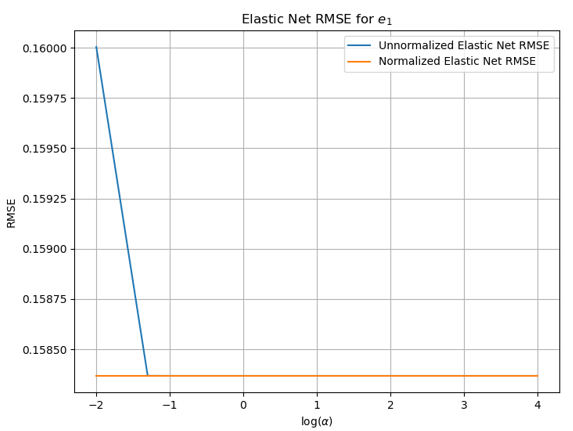

# Guardians of the Galaxy

May An van de Poll$^{1}$, Evan McCormick$^{1}$ and Ranajit Roy$^{1}$
$^{1}$The University of Colorado Boulder, Boulder, Colorado 80309, USA

## Problem space
It is hypothesized that gravitational lensing could help to understand the nature of dark matter and dark energy that are believed to dominate our Universe [1]. The effect of gravitational lensing is the appearance of distortion of the shapes of galaxies and this effect can be captured by a matrix distortion applied to the galaxy image:

$\begin{pmatrix}
		x_{u} \\  y_{u}
	\end{pmatrix} = \begin{pmatrix}
   1-g_{1} & -g_{2} \\
   -g_{2} & 1+g_{1}
\end{pmatrix} \begin{pmatrix}
		x_{1} \\  y_{1}
	\end{pmatrix}$

$\begin{pmatrix}
		x_{u} \\  y_{u}
	\end{pmatrix}$ denotes a point on the original galaxy image and $\begin{pmatrix}
		x_{1} \\  y_{1}
	\end{pmatrix}$  denotes the new position of this point on the distorted image [1].

A positive shear $g_{1}$ stretches an image along the $x$-axis and compresses along the $y$-axis while the same for $g_{2}$ stretches the image along the diagonal $y=x$ and compressed along $y=-x$.

The challenge lies in the fact that galaxies are not perfectly circular by themselves, therefore we cannot determine a priori whether shearing by gravitational lensing is present for each image.

The shear effect produces an additional ellipticity in an object image where ellipticity is defined as 

$s=(1-r)(1+r)^{-1}e^{2i\phi}$ with $r$ the ratio of the major to minor axes in the image and $\phi$ the angle of orientation.

Taking into account the intrinsic ellipticity $s^{intrinsic}$ that a galaxy has means that the measured ellipticity per galaxy can be expressed as 

$s^{observed}=s^{intrinsic}+g/(1+g*s^{intrinsic}) \approx s^{intrinsic} +g$.

Here we have used $s$ to represent ellipticity to not confuse it with the exponential but will later define ellipticity $e_{1}$ and $e_{2}$.

The sheared galaxy images are locally convolved by a Point Spread Function (PSF) spatially varying across the images.

To improve accuracy in results it is important to look at galaxy images in conjunction with star images to extract the shear field in the presence of the unknown convolution kernel. The star images are not sheared. Furthermore, the star and galaxy images are pixelized by summing the intensity in square pixels and uncorrelated Gaussian distributed noise is added to the images [2].

The goal is to take the root mean square (RMS) of the true $e_{1}$ and $e_{2}$ values and compare them to values in the Kaggle competition. Where $e_{1}$ and $e_{2}$ are the ratios of the major to minor axis of the object and the angle of the object [3]:

$$e_{1} = \frac{(a-b)}{(a+b)} \cos(2\theta)$$

$$e_{2} = \frac{(a-b)}{(a+b)} \sin(2\theta)$$

The project is originally a Kaggle competition and is based on the GREAT08 and GREAT10 challenges. Methods that have been addressed in the competition are Unweighted Quadrupole Moment (UWQM) [3].

Here we will present the methods of linear regression using regularization (Ridge, Lasso and Elastic Net), custom feature extraction, Wiener filter deconvolution and convolutional neural networks.

## Dataset

The dataset analyzed consists of 100,000 star-galaxy image pairs, and 100,000 ellipticity
measurements [e1 e2], corresponding to each galaxy image. An example of 1 observation in the
dataset is shown in figure 1. There are 4610 total numeric features for each observation in this dataset: One $48^2$ pixel grayscale image of the galaxy, and one $48^2$ pixel grayscale image of the corresponding star, filtered through the same convolution kernel as the galaxy. The final two features are the [ e1, e2 ] values representing the true ellipticity measurements for the galaxy in the galaxy image [3]. Higher-order features in the pixel data were extracted, both manually, and by some of the convolutional neural networks implemented.

galaxy image |  star image
:-------------------------:|:-------------------------:
  |  

## Methods
Our main objective is to minimize the error between the observed and predicted values. A first method that is used is linear regression using Ridge and Lasso as regularization without feature extraction. Regularization is used to avoid overfitting of data and done by implementing a penalty term that will decrease variance with tested data and reduce influence of predictor variables over the output variable by reducing the amplitude of coefficients. 

The error was calculated by using the sum of square of residuals ($RSS$) to give higher penalty to larger errors, where $RSS$ is given by $$\sum_{i=1}^{n}(y_{i}-(w_{i}x_{i}+b))^{2}$$ [4, 5].

### Ridge Regression

Ridge regression adds a penalty term to the cost function to keep the parameters small. The cost function ensures that the training data is fitted well and is given by

$J(\theta_{0}, \theta_{1})=\frac{1}{2m}\sum_{i=1}^{m}(h_{\theta}(x^{i})-y^{i})^{2}$.

where $y$ is the predicted value, $x$ the input value, $w$ the coefficient, $\lambda$ the penalty term, and $h_{\theta}$ a simple linear regression equation of the form $\theta_{1}x+\theta_{0}$.

The penalty or regularization term is called the $L_{2}$ norm and adds the term 

$\alpha\sum_{j=1}^{p}w_{j}^{2}$ to the $RSS$ or 

$\frac{\lambda}{2m}\sum_{j=1}^{n}\theta_{j}^{2}$ to the cost function [4,5].

Using Ridge regression both the error and the size of the coefficients have to be minimized. 
Putting it together, Ridge minimizes [6]

$$\frac{1}{N}\sum_{i=1}^{N} ||y_i-\mathbf{w}^T \mathbf{x_i}-\mathbf{b}||^2 + \alpha||\mathbf{w}||^2$$

with $\mathbf{w}$ the coefficients vector for the linear regression model, $\mathbf{b}$ the intercept vector, $\alpha$ the regularization parameter and $N$ the number of samples [4, 5].

### Lasso regression

LASSO (Least Absolute Shrinkage and Selection Operator) is a regression model that uses L1 regularization. Lasso minimizes [4, 5, 6] $$\frac{1}{2N}\sum_i ||y_i-\mathbf{w}^T \mathbf{x}_i -\mathbf{b}||^2 + \alpha||\mathbf{w}||_1$$ where the last term is the penalty term. This regularization type can result in sparse models because some coefficients might get eliminated from the model as they shrink to zero. This in contrast with $L_{2}$ regularization in Ridge regression which does not result in any elimination of sparse models or coefficients. Thus, Lasso Regression is easier to interpret as compared to the Ridge but with too many features it might be difficult to pick the right features [5].

### Elastic Net
Elastic Net combines both Ridge and Lasso regression by using both the L1 and L2 term for regularization and minimizes 

$$\frac{1}{2N} \sum_i ||y_i - \mathbf{w}^T\mathbf{x}_i -\mathbf{b}||^2_2 + \alpha\beta||\mathbf{w}||_1 + \frac{\alpha}{2}(1 - \beta)||\mathbf{w}||^2_2$$

with $\beta\in[0,1]$ is the $L_{1}$ ratio ($\beta=1$ for Lasso and $\beta=0$ for Ridge since Lasso works with $L_{1}$ and Ridge with $L_{2}$) [6].

### Image Deconvolution

We attempted to utilize the Wiener filter to approximate the original image by eliminating any noise that may have been added to it. Through our experimentation, we discovered that the Wiener filter is highly effective for this task. Its effectiveness lies in its optimality in minimizing the mean square error, making it the optimal choice for both inverse filtering and noise reduction. Essentially, the Wiener filter employs a linear estimation technique to produce the most accurate approximation of the original image [7].

$G(f) = \dfrac{1}{H(f)}\left[\dfrac{1}{1+1/(|H(f)|^2SNR(f))}\right]$

Here G(f) and H(f) are fourier transforms of inverse convolution and original (atmospheric) convolution funtions, respectively and SNR(f) is the singnal to noise ratio. So if we have the original (atmospheric) convolution with SNR(f) we can roughly estimate the inverse convolution and apply that to get the original image.

Now we know that the same atmospheric convolution was applied to both the image pair and a star image is basically a point source of light. So we can assume that the star image itself is the original convolution. Now we only have to estimate the value of SNR which we can do by trail and error.
galaxy image from dataset  |  deconvolved image
:-------------------------:|:-------------------------:
  |  

### Unweighted Quadrupole Moment (UWQM)

Unweighted Quadrupole Moment is simple method to guess the major and minor axis of galaxies. But due to the presence of noise on the images, this method may not effective enough.

    FUNCTION getUWQM(image):
        pixel_len = LINSPACE(1, image.shape[0], image.shape[0])
        x, y = MESHGRID(pixel_len, pixel_len)

        sum_pix = SUM(image)
        im_meanx = SUM(image * x) / sum_pix
        im_meany = SUM(image * y) / sum_pix

        q11 = SUM(image * (x - im_meanx) * (x - im_meanx)) / sum_pix
        q12 = SUM(image * (x - im_meanx) * (y - im_meany)) / sum_pix
        q22 = SUM(image * (y - im_meany) * (y - im_meany)) / sum_pix

        e1 = (q11 - q22) / (q11 + q22)
        e2 = 2 * q12 / (q11 + q22)
        RETURN e1, e2

### Custom Feature Extraction

We tried a different way of approaching the problem apart from simple CNN. First we tried using guassian filter to reduce noise and then normalized the images to get a better distribution of light throughout the image. Then we reduced the bit depth and tried using Bresenham's line algorithm to draw imaginarly lines intersecting each other through the center of the image. Then we summed up the pixel with higher value than a threshold or light on the lines to get a feature vector of length 12 for each image.

### Convolutional Neural Network (CNN)

A convolutional neural network is a type of neural network designed specifically for extracting information from images, by first extracting image features, which can then be input into a classical neural network.

A classical neural network, or multi-layer perceptron ($MLP$) consists of multiple layers each of which take $d$ inputs and return $q$ outputs through the use of a function $f_\theta:  \mathbb{R}^d \mapsto \mathbb{R}^q$, where the parameter is optimized to minimize the loss $L$. This approach also used $MSE$ for the loss function, with

$MSE = \frac{1}{m} \sum_{i=1}^{m} ||f_\psi(x_i) - y_i ||^2$

where $f_\psi(x_i)$ is the final output layer of the neural network for input observation $x_i$. Most layers are densely connected (i.e each output $y_{i,q} = \sum_{i=1}^p ||f_\psi(x_{i,p})$), A CNN utilizes a particular type of function called a *convolution kernel*, which takes in a matrix of size $(m \times n)$ and outputs a scalar variable. The convolution kernel assigns a weight an a bias to each scalar observation $X_{i,j}$ within the input matrix and returns the sum of the resulting values. 

In a convolution layer, the convolution kernel is passed through input matrix $X_{(p \times q)}$, such that for each matrix   $M_{i,j (p \times q)}$ with top-left corner at index $X_{i,j}$, output 

$$Y_{i,j} = f_{cKern}(M_{i,j})$$

where $f_{cKern}$ is the convolution kernel function. For the raw CNN analysis of the galaxy-image pairs (in which data was fed directly into the CNN with no feature extraction), a we used a CNN consisting of three successive convolutional kernels with Rectivied Linear Unit (ReLU) activation functions of size $(16 \times 16)$, $(10 \times 10)$, and $(8 \times 8)$ followed by a conventional MLP with two $(64 \times 64)$ dense layers with ReLU activation.

#### Model: "sequential"
    _________________________________________________________________
    Layer Type                  Input Shape             Trainable Params
    _________________________________________________________________
    conv2d (Conv2D)              (None, 33, 33, 8)         2056      
    _________________________________________________________________
    conv2d_1 (Conv2D)            (None, 24, 24, 16)        12816     
    _________________________________________________________________
    conv2d_2 (Conv2D)            (None, 17, 17, 8)         8200      
    _________________________________________________________________
    flatten (Flatten)            (None, 2312)              0         
    _________________________________________________________________
    dense (Dense)                (None, 64)                148032    
    _________________________________________________________________
    leaky_re_lu (LeakyReLU)      (None, 64)                0         
    _________________________________________________________________
    dense_1 (Dense)              (None, 64)                4160      
    _________________________________________________________________
    leaky_re_lu_1 (LeakyReLU)    (None, 64)                0         
    _________________________________________________________________
    dense_2 (Dense)              (None, 2)                 130       
    =================================================================
    Total params: 175,394
    Trainable params: 175,394
    Non-trainable params: 0
_________________________________________________________________

## Results
We tried differenet combinations of above mentioned methods to predict the values of both $e_1$ and $e_2$ of the galaxies.

The UWQM method gave the worst results. The method gave bad results even when we deconvolved the images before applyting UWQM. This is maybe because the presence of even a small amount noise creates enough deviation in the data that it doesn't work properly.

Both regression methods were implemented with the sklearn package in Python and are tested for different penalty regularization parameter values $\alpha$. In particular, $\alpha$= [0.01, 0.05, 0.1, 0.2, 0.3, 1, 10, 100, 300, 500, 1000, 1500, 2000, 5000, 10000].
The mean (Root Mean Square Error) RMSE values for $e_{1}$ data using Ridge regression are 0.1685 and 0.1611 for the unnormalized and normalized data. For $e_{2}$ the values are 0.1511 and 0.1446 for the unnormalized and normalized data.
For Lasso the mean RMSE values for $e_{1}$ are 0.1584 for both normalized and unnormalized data.
For $e_{2}$ the respective RMSE values are 0.1422.
The table below summarizes the average RMSE values for Ridge and Lasso regression for the normalized data for $e_{1}/e_{2}$.
The two figures below show the normalized and unnormalized RMSE for $e_{1}$ for the Ridge and Lasso regression methods respectively.
Ridge  |  Lasso
:-------------------------:|:-------------------------:
  |  

In both cases the normalized data shows a better minimization of the RMSE values as a function of $$\log_{10}(\alpha)$$. On average Lasso has a RMSE value that is lower by 0.0027 than Ridge for the normalized data.
For Elastic Net the average RMSE for $e_{1}$ for the unnormalized and normalized data are 0.1585 and 0.1584 for a $L_{1}$ ratio of 0.5. For $e_{2}$ these values are 0.1423 and 0.1422. The corresponding plot is shown for $e_{1}$.

Raw CNN analysis of the galaxy-image pairs resulted in an MSE of $.000473$, or $4.73 \times 10^{-4}$. RMSE scores were $.02174$, or $2.174 \times 10^{-2}$. This way better than any other methods we used for predicting the two values.

From the above plot we can clearly see that cross validation MSE value is gradually decreasing with every epoch.

We experimented with utilizing CNN on star images, incorporating extracted features from galaxy images. Although the results were slightly worse than using pure CNN, they were certainly an improvement over UWQM, with an RMSE of $0.0421$. We also attempted to use CNN on custom feature vectors extracted from both galaxy and star images, which produced similar results with an RMSE of $0.0422$ as the previous method.

As a final step in our experimentation, we ran the CNN on the deconvolved galaxy image with the application of the Wiener filter. This approach yielded the most favorable results (RMSE: $0.0191$) compared to all other combinations we tried. We believe that this is due to the fact that the Wiener filter was successful in significantly reducing the noise that came with the image. As a result, the input image was a more accurate representation of the actual galaxy without any atmospheric distortions, enabling the CNN to more clearly detect the ellipticity of the galaxy.

| Methods used                            | average RMSE  |
:-----------------------------------------|---------------:
| Ridge                                   | 0.1611/0.1446
| Lasso                                   | 0.1584/0.1422 |
| Elastic Net                             | 0.1584/0.1422 |
| CNN on galaxy + star                    | 0.0217        |
| CNN on star + custom features of galaxy | 0.0421        |
| CNN on custom features of galaxy + star | 0.0422        |
| UWQM on galaxy                          | 0.3473        |
| UWQM on deconvolved galaxy images       | 0.3530        |
| CNN on deconvolved galaxy images        | 0.0191        |
| Tournament best                         | 0.0151        |

## Conclusion and Discussion
In this analysis, convolutional neural networks outperformed both traditional neural networks and regression models in measuring ellipticity, a feature of the galaxy-star image pairs. 
For the Elastic Net regression model some tuning of the $L_{1}$ ratio could perhaps improve its RMSE. 
More generally, CNNs appear to be extremely powerful in discerning relevant feature information from images, a process known as *feature extraction*. We have seen that our own custom feature extraction was not so successful in identifying import features. However the Wiener filter worked really well to preprocess the images. Applying CNN on these preprocessed images worked better than pure CNN.

The success of this approach highlights the importance of preprocessing steps like deconvolution and filtering in enhancing the accuracy of CNNs in image analysis. It also suggests that careful consideration of the specific characteristics of the input images and the type of analysis being conducted can yield significant improvements in accuracy. These findings can have broad implications in various fields that rely on image analysis, including astronomy, medical imaging, and remote sensing.

We plan to explore several potential avenues for future work related to image denoising. Specifically, we are interested in investigating the use of alternative denoising filters, as well as exploring the use of more advanced machine learning techniques for image denoising.

One potential approach that we plan to explore is the use of alternative denoising filters such as mean and median filtering, Bilateral filtering, and others. While we have already tested the Wiener filter, we believe that other approaches may offer additional benefits in terms of accuracy.

In addition to testing alternative denoising filters, we also plan to explore the use of more advanced machine learning techniques for image denoising. One potential approach is to use pre-trained DnCNN, a feed-forward CNN designed specifically for denoising images. This method has been shown to be effective in previous research and has a relatively short runtime, but the time complexity of the learning process is high. Nevertheless, we believe that exploring the use of DnCNN could offer significant improvement.

Another technique that we plan to explore is the use of Toeplitz matrix formulation and optimizing neural networks like Hopfield neural network (HNN). The Hopfield model is a recurrent model that consists of only one layer of neurons, all interconnected so that each neuron is both an input and an output, creating a self-feedback loop with delayed connection from a neuron to itself. The weight matrix between neurons is symmetrical, e.g., $w_{ij} = w_{ji}$. One of the advantages of HNN is that it does not require prior information, and the neurons can be initialized with any non-negative values.

Overall, we believe that there are several potential avenues for future work related to image denoising that can improve accuracy of our models.

## References
1. R. Massey et al., “Handbook for the GREAT08 Challenge: An Image Analysis Competition for Cosmological Lensing,” arXiv:0802.1214, 2008.
2. T. Kitching et al., “Gravitational lensing accuracy testing 2010 (GREAT10) challenge handbook,” Annals of Applied Statistics, vol. 6, no. 4, pp. 2231-2263, 2011.
3. AstroTom. "Mapping Dark Matter," Kaggle, 2011. [Online]. Available: https://kaggle.com/competitions/mdm. [Accessed: May 07, 2023].
4. M. Arashi et al., “Theory of ridge regression estimation with applications,” John Wiley & Sons, 2019.
5. S. Jain, “Lasso & Ridge Regression: A Comprehensive Guide in Python & R (Updated 2023),” Analytics Vidhya, Jun. 22, 2017. [Online]. Available: https://www.analyticsvidhya.com/blog/2017/06/a-comprehensive-guide-for-linear-ridge-and-lasso-regression/. [Accessed: May 07, 2023].
6. D. Quigley, “Problem Set 3 - Linear Regression, Logistic Regression, and Naive Bayes,” CSCI 5622 - Spring 2023.
7. J. Chen et al., “New insights into the noise reduction Wiener filter,” IEEE Transactions on Audio, Speech, and Language Processing, vol. 14, no. 4, pp. 1218-1234, 2006.
